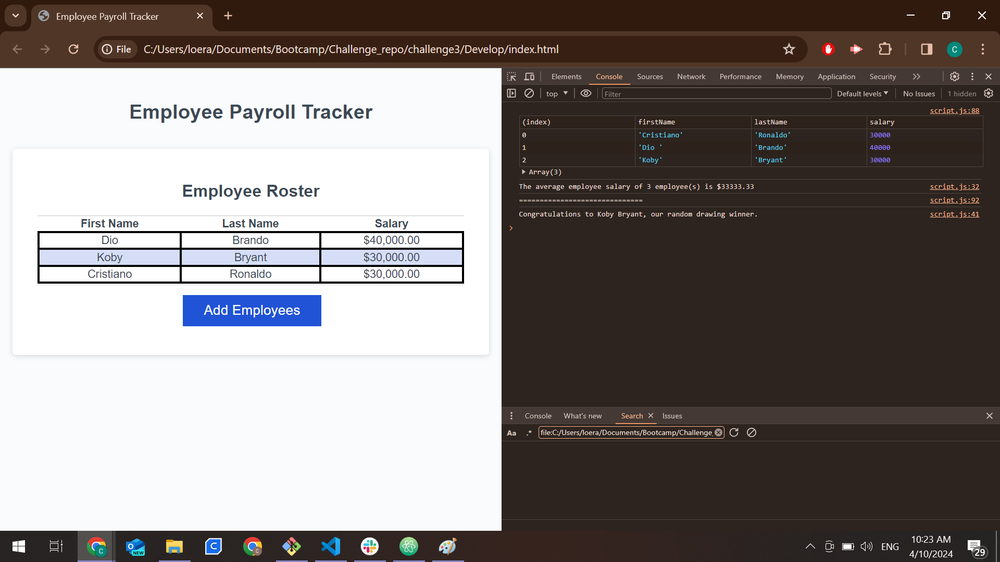
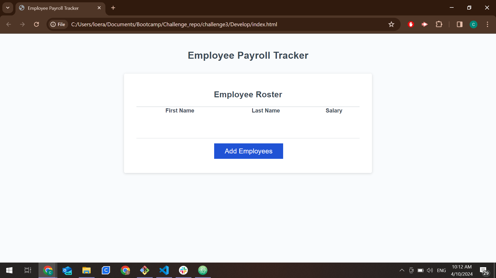

#Challenge 3: Employee Payroll Tracker

This challenge was to met the Acceptance Criteria:

-WHEN I click the "Add employee" button.

-THEN I am presented with a series of prompts asking for first name, last name,
and salary.

-WHEN I finish adding an employee.

-THEN I am prompted to continue or cancel.

-WHEN I choose to continue.

-THEN I am prompted to add a new employee.

-WHEN I choose to cancel.

-THEN my employee data is displayed on the page sorted alphabetically by

Last name, and the console shows the Array, the average employee salary,
and a random drawing winner.

I worked on the collectEmployees, displayAverageSalary, and getRandomEmployee,
functions.

In the collectEmployees, the User inputs the name of the employee and
the salary, and ask if you want to add another one.

In displayAverageSalary, calculates the average salary of the employees.

In getRandomEmployee, take a random number from the employees and get the
firstName and lastName.

